

# Overview

- SRE Engineer of 3-shake, Inc.
- CTO of yakudou, Inc.
- 24 years old

## Socials

[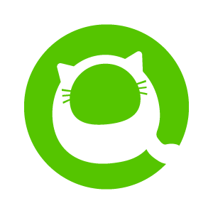](https://qiita.com/yokoo-an209)

## Award
- [2023 Japan AWS Jr.Chmapions](https://aws.amazon.com/jp/blogs/psa/2023-japan-aws-jr-champions/)
- [2023 Japan AWS All Certifications Engineers](https://aws.amazon.com/jp/blogs/psa/2023-japan-aws-all-certifications-engineers/)

## Certifications
[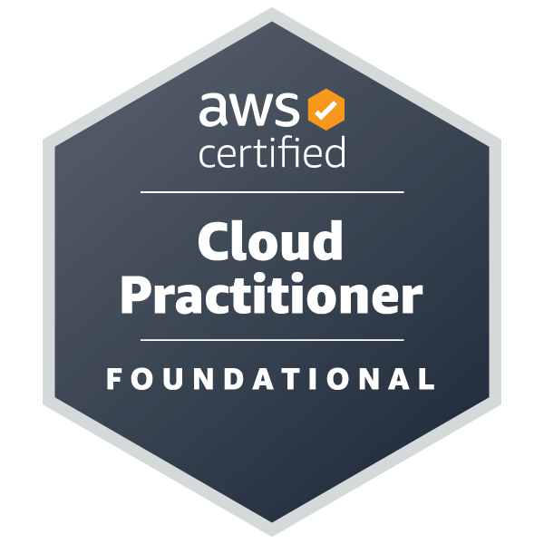](https://aws.amazon.com/jp/certification/certified-solutions-architect-associate/)
[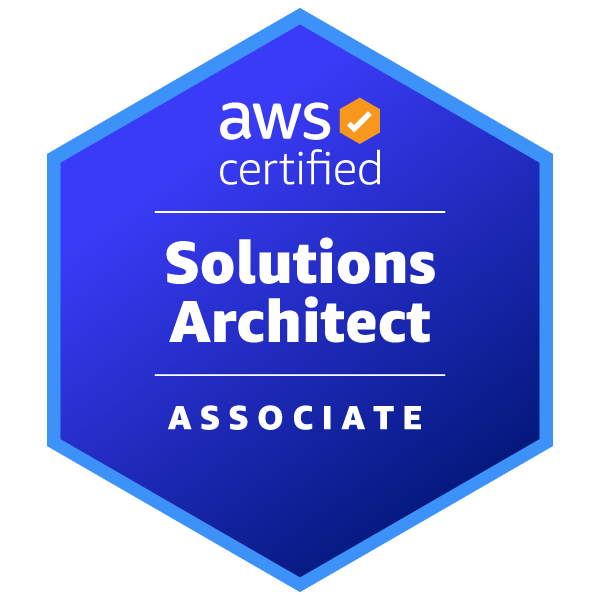](https://aws.amazon.com/jp/certification/certified-solutions-architect-associate/)
[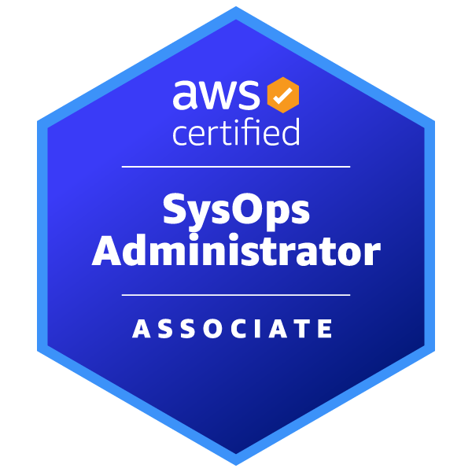](https://aws.amazon.com/jp/certification/certified-sysops-admin-associate/)
[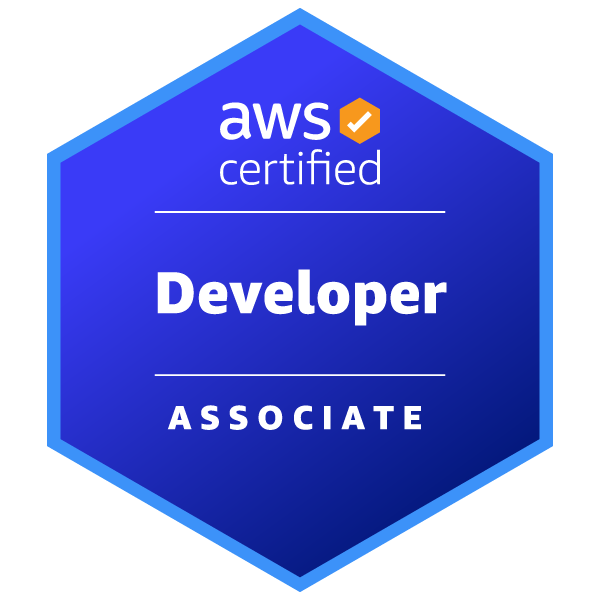](https://aws.amazon.com/jp/certification/certified-developer-associate/)
[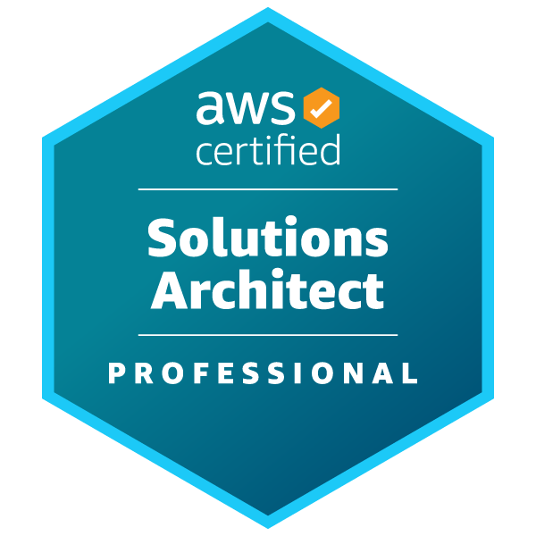](https://aws.amazon.com/jp/certification/certified-developer-associate/)
[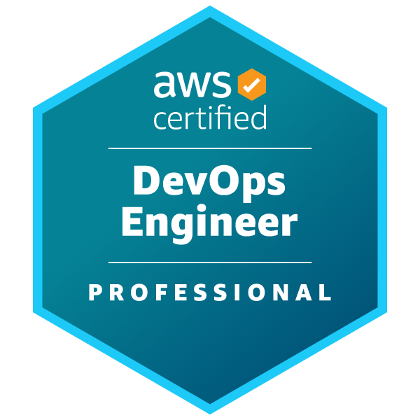](https://aws.amazon.com/jp/certification/certified-developer-associate/)
[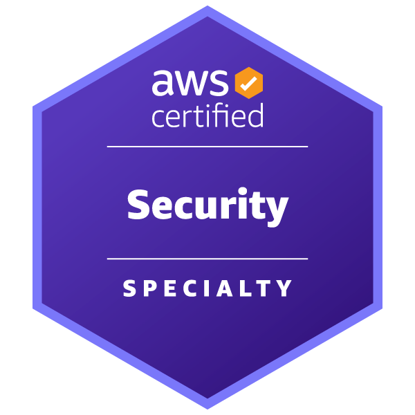](https://aws.amazon.com/jp/certification/certified-developer-associate/)

[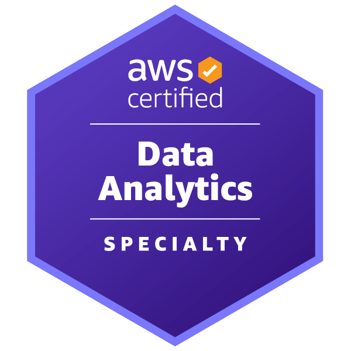](https://aws.amazon.com/jp/certification/certified-developer-associate/)
[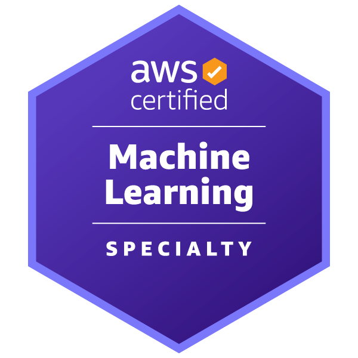](https://aws.amazon.com/jp/certification/certified-developer-associate/)
[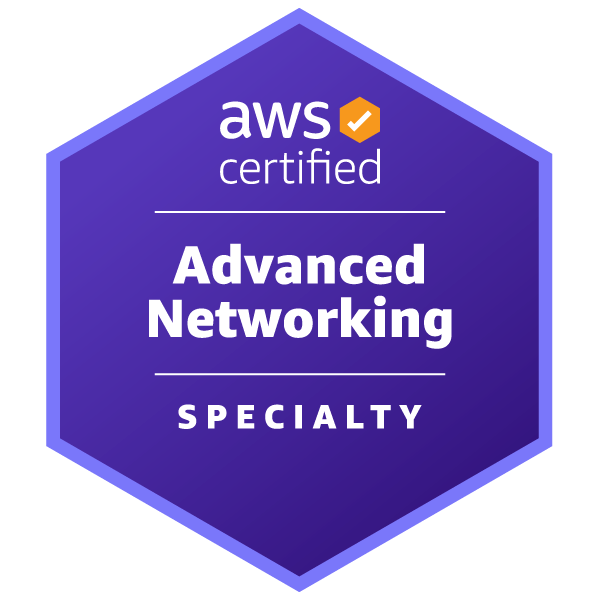](https://aws.amazon.com/jp/certification/certified-developer-associate/)
[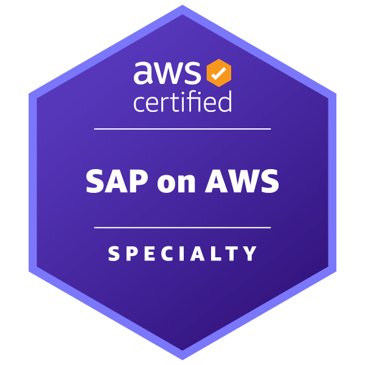](https://aws.amazon.com/jp/certification/certified-developer-associate/)
 

## Skills
### WebApplication

<!-- [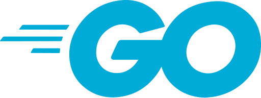](https://golang.org/) -->

<!--  -->
<!-- [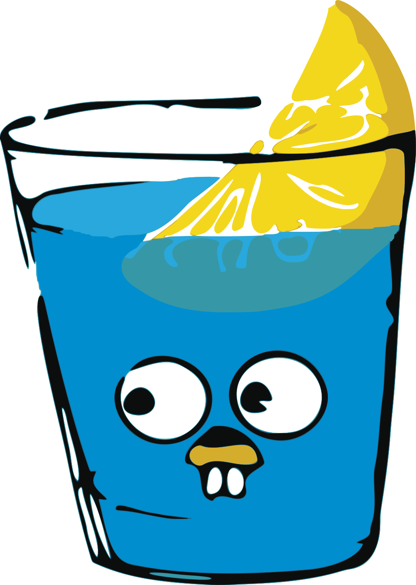](https://gin-gonic.com/) -->
### SRE

[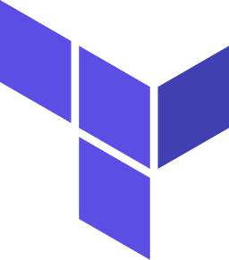](https://www.terraform.io/)

<!--  -->
# Status
<!-- リポジトリステータス -->

<!-- ソースコード統計 -->

## Contact

- [yokoo.an209@gmail.com](mailto:yokoo.an209@gmail.com)