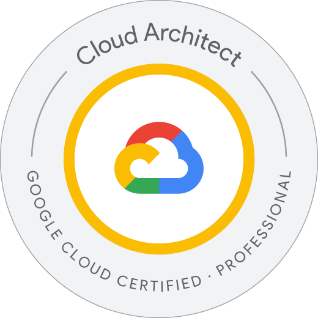
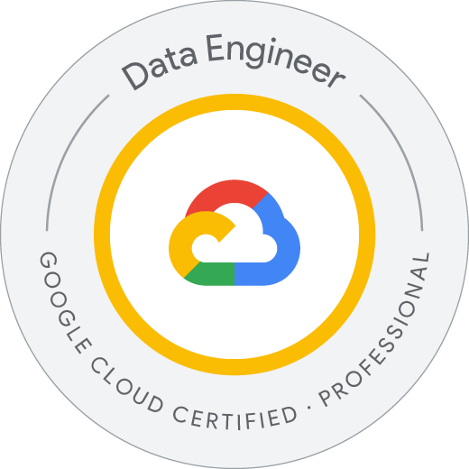
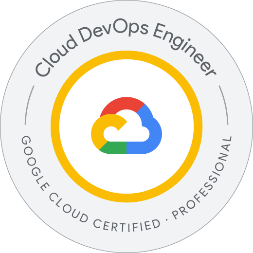
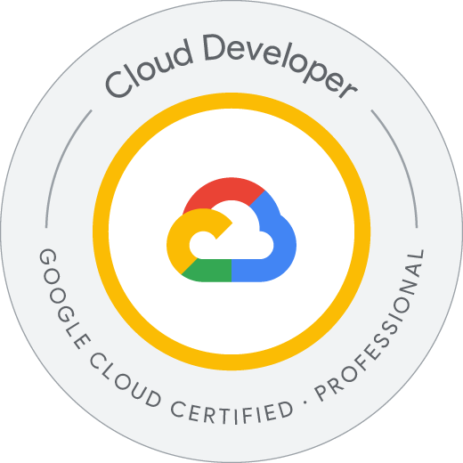
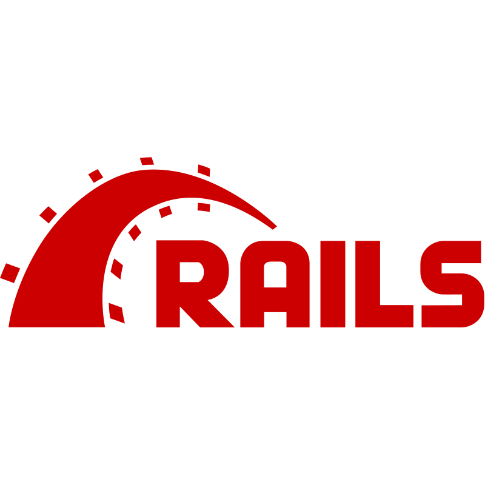
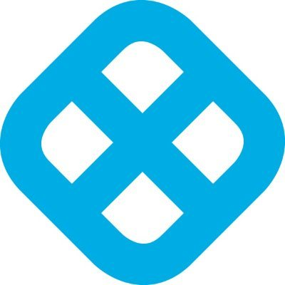

# Overview

3-shake Co., Ltd. - Sreake Division. 
Responsible for providing technical support in the SRE/CloudNative domain

I started my careeer as a Software Engineer mainly the backend skill (04/2021-06/2023). 
Then now I'm a Site Reliability Engineer at 3-shake, inc（07/2023 ~ now）

【Specilization & Expertise】
 - 2+ years of software engineering experience in public cloud and related technologies. Big love to cloud native technologies & cloud communities.
 - Extensive knowledge of o11y, SRE, DevOps and tools of them.
 - 6x Google Cloud Certified, 12x AWS Certified

【Awards】
- [2023 Japan AWS Jr.Chmapions](https://aws.amazon.com/jp/blogs/psa/2023-japan-aws-jr-champions/)
- [2023 Japan AWS All Certifications Engineers](https://aws.amazon.com/jp/blogs/psa/2023-japan-aws-all-certifications-engineers/)

【Communities】
 - Organizer of Jagu'e'r - CloudNative Subcommittee & Observability-SRE Subcommittee (Japan Google Cloud User Group for Enterprise)
 - Speaker at Jagu'e'r, JAWS-UG, SRETT, [Google Cloud Modern App Summit Tokyo'24](https://cloudonair.withgoogle.com/events/modern-app-summit-24?talk=session-c1)

## Social link

<!--  -->

## Certifications

 

<!-- ## Skills
### WebApplication

### SRE

 -->

# Status
<!-- リポジトリステータス -->

<!-- ソースコード統計 -->

## Contact

- [yokoo.an209@gmail.com](mailto:yokoo.an209@gmail.com)